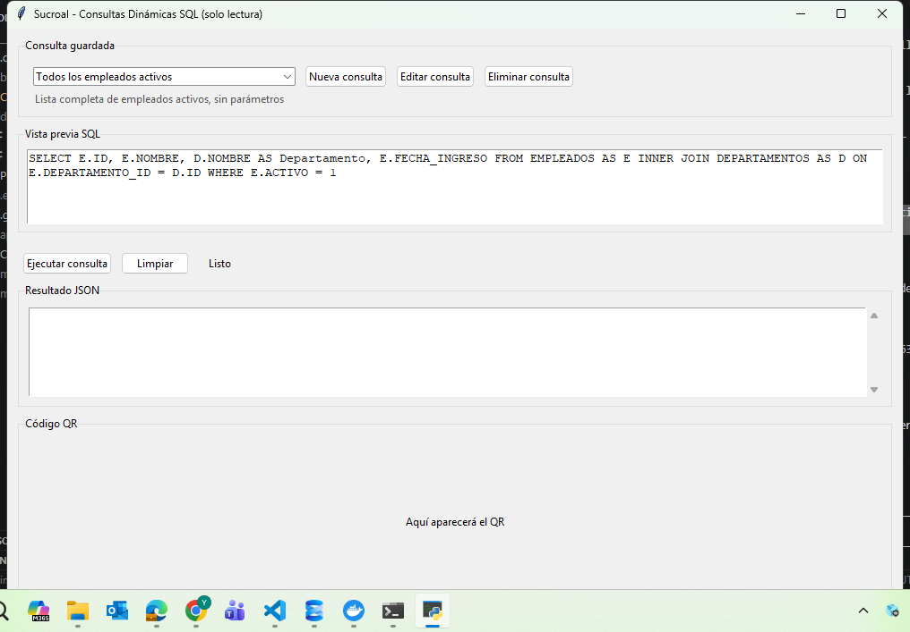
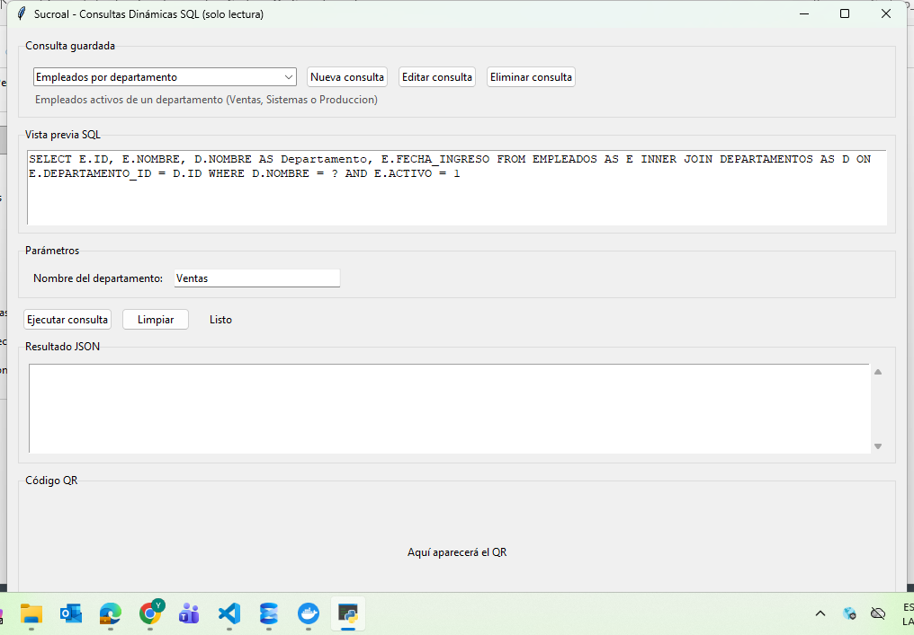
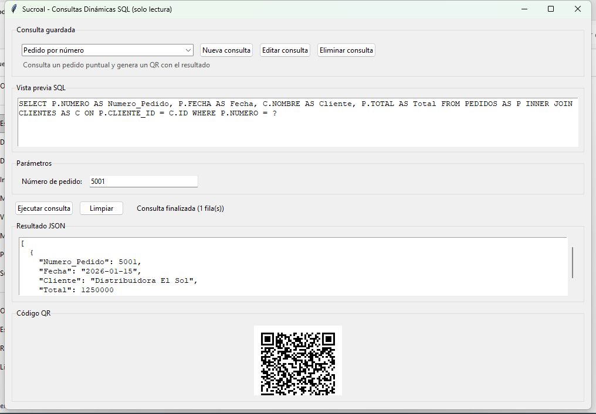
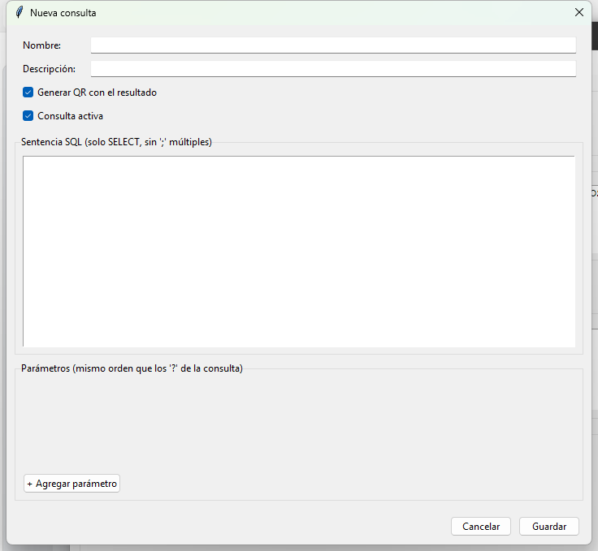
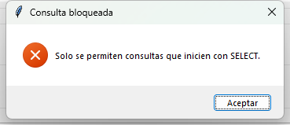

# Consultas Dinámicas SQL (solo lectura) con QR

Aplicación de escritorio para uso interno que permite ejecutar consultas SQL Server
predefinidas y guardadas por el usuario, sin tocar código para agregar o cambiar una
consulta. Cada consulta se define una vez (nombre, SQL, parámetros) desde la propia
interfaz, queda disponible en un selector, y al ejecutarla el resultado se muestra en
pantalla en JSON y, opcionalmente, como código QR para escanear en otra estación.

El único requisito de seguridad no negociable: la aplicación **nunca** ejecuta nada que
no sea un `SELECT` de una sola sentencia. Cualquier intento de `INSERT`, `UPDATE`,
`DELETE`, `DROP`, `EXEC`, procedimientos almacenados, múltiples sentencias, etc. se
bloquea antes de tocar la base de datos.

## Stack

- **Lenguaje**: Python 3.
- **Interfaz**: Tkinter / ttk (aplicación de escritorio nativa, sin navegador).
- **Base de datos**: SQL Server vía `pyodbc`, con consultas siempre parametrizadas.
- **QR**: `qrcode` + `Pillow` para generar y mostrar el código a partir del resultado.
- **Configuración**: `python-dotenv` para credenciales (`.env`), y un `queries_config.json`
  local para las consultas guardadas (no requiere base de datos ni backend propio).
- **Empaquetado**: PyInstaller, para distribuir la app como un `.exe` de Windows sin
  requerir Python instalado en el equipo del usuario final.

## Estructura del proyecto

```
main_dynamic.py               # Aplicación completa (UI, validación de seguridad, acceso a datos)
queries_config.example.json   # Ejemplo de formato de consultas guardadas (datos ficticios)
.env.example                  # Ejemplo de variables de conexión a SQL Server
crear_login_solo_lectura.sql  # Script opcional para el DBA: login de SQL Server solo-lectura
```

Este repositorio contiene únicamente la herramienta de consultas dinámicas. El
`queries_config.json` real (con las consultas y nombres de tablas propios del ERP de la
empresa), el `.env` con credenciales reales, y la versión anterior de la aplicación (una
sola consulta fija embebida en el código) son internos y no se publican aquí.

## Requisitos previos

- Python 3.10+
- Driver ODBC de SQL Server instalado en el sistema (por ejemplo, "ODBC Driver 17 for
  SQL Server"). Descarga: https://learn.microsoft.com/es-es/sql/connect/odbc/download-odbc-driver-for-sql-server?view=sql-server-ver17
- Dependencias:

```
pip install pyodbc qrcode pillow python-dotenv pyinstaller
```

## Configuración

1. Copia `.env.example` a `.env` y completa los datos de tu servidor:

   ```
   DB_DRIVER=ODBC Driver 17 for SQL Server
   DB_SERVER=tu_servidor
   DB_DATABASE=tu_base
   DB_USER=usuario_solo_lectura
   DB_PASSWORD=tu_password
   DB_WINDOWS_AUTH=False
   DB_TIMEOUT=5
   ```

2. Copia `queries_config.example.json` a `queries_config.json` como punto de partida, o
   simplemente arranca la app y crea tus consultas desde el botón "Nueva consulta" — el
   archivo se genera solo si no existe.

3. (Recomendado) Pide a tu DBA que ejecute `crear_login_solo_lectura.sql` para que la app
   se conecte con un login que solo tiene permiso `SELECT`, como segunda capa de defensa
   además de la validación que hace la propia aplicación.

## Ejecutar el proyecto

```
python main_dynamic.py
```

Para generar el ejecutable de Windows:

```
pyinstaller --noconfirm --onefile --windowed --name "Consultas Dinamicas" main_dynamic.py
```

El `.exe` resultante debe distribuirse junto con `.env` y `queries_config.json` en la
misma carpeta (se leen del directorio de trabajo, no quedan empaquetados dentro del exe).

## Cómo se usa (paso a paso)

### 1. Ventana principal



- **Consulta guardada**: selector con todas las consultas activas guardadas en
  `queries_config.json`. Al elegir una, aparece su descripción justo debajo.
- **Nueva consulta / Editar consulta / Eliminar consulta**: administran las consultas
  guardadas (ver sección siguiente).
- **Vista previa SQL**: muestra el `SELECT` exacto que se va a ejecutar, de solo lectura
  (no se puede editar desde aquí — para cambiarlo hay que usar "Editar consulta").
- **Ejecutar consulta / Limpiar**: ejecutan la consulta seleccionada o limpian el
  resultado y el QR en pantalla.
- **Resultado JSON**: el resultado de la consulta, siempre en JSON.
- **Código QR**: si la consulta tiene el QR habilitado, aquí aparece el código generado
  a partir del resultado.

### 2. Elegir una consulta y llenar sus parámetros

Al seleccionar una consulta con parámetros (por ejemplo, una que filtra por número de
pedido o por nombre de departamento), la app genera automáticamente un campo por cada
parámetro declarado, con el tipo correcto (texto, entero, decimal o fecha):



Si dejas vacío un parámetro marcado como obligatorio, o escribes un valor que no
corresponde al tipo (por ejemplo, letras en un campo entero), la app lo rechaza antes de
tocar la base de datos y te dice cuál es el problema.

### 3. Ejecutar y ver el resultado + QR

Al presionar **"Ejecutar consulta"**, el resultado aparece como JSON y, si esa consulta
tiene marcada la opción "Generar QR", el código QR se genera a partir de ese mismo JSON:



Si la consulta no devuelve filas, no hay nada que codificar: el panel del QR lo indica
explícitamente ("Sin resultados: no hay datos para generar el QR") en vez de quedar en
blanco sin explicación.

### 4. Crear una consulta nueva

Con **"Nueva consulta"** se abre el formulario para definir una consulta desde cero, sin
tocar código:



- **Nombre**: como aparecerá en el selector de la ventana principal.
- **Descripción**: texto corto que se muestra debajo del selector al elegirla.
- **Generar QR con el resultado**: si se marca, cada ejecución exitosa genera un QR.
- **Consulta activa**: si se desmarca, la consulta se guarda pero no aparece en el
  selector (útil para dejarla pausada sin borrarla).
- **Sentencia SQL**: el `SELECT` a ejecutar. Los parámetros van como `?` en el orden en
  que se van a llenar (igual que en `pyodbc`).
- **Parámetros**: un botón "+ Agregar parámetro" por cada `?` de la consulta, en el mismo
  orden. Cada parámetro tiene nombre interno, etiqueta visible, tipo (`str`/`int`/`float`/
  `date`) y si es obligatorio.
- **Guardar**: antes de guardar, valida que el SQL sea de solo lectura y que la cantidad
  de parámetros coincida con la cantidad de `?` — si algo no cuadra, explica exactamente
  qué corregir.

**Editar consulta** abre el mismo formulario con los datos ya cargados; **Eliminar
consulta** la borra de `queries_config.json` (pide confirmación antes).

### 5. Qué pasa si se intenta algo que no sea solo lectura

Tanto al guardar como al ejecutar, cualquier intento de `INSERT`, `UPDATE`, `DELETE`,
`DROP`, `EXEC`, procedimientos, o varias sentencias separadas por `;`, se bloquea antes de
tocar la base de datos:



## Funcionalidades

- Selector de consultas guardadas, con vista previa del SQL antes de ejecutar.
- Crear, editar y eliminar consultas guardadas desde la interfaz (persisten en
  `queries_config.json`, sin tocar código).
- Formularios de parámetros generados dinámicamente según el tipo declarado (texto,
  entero, decimal, fecha), con validación antes de ejecutar.
- Validación de solo lectura antes de guardar y antes de ejecutar cualquier consulta:
  bloquea `INSERT/UPDATE/DELETE/DROP/ALTER/CREATE/TRUNCATE/MERGE/EXEC/EXECUTE/USE/GRANT/
  REVOKE/DENY/BACKUP/RESTORE/PUT/INTO`, procedimientos (`sp_`/`xp_`) y sentencias múltiples
  separadas por `;`.
- Límite de 500 filas por consulta (del lado de la app) y advertencia si una consulta no
  tiene `TOP` ni `WHERE`, antes de ejecutarla.
- Resultado en JSON en pantalla y, si la consulta lo tiene habilitado, código QR generado
  a partir de ese mismo resultado.
- Ejecución en un hilo aparte para que la interfaz no se congele mientras consulta la base.
- Errores de conexión, de SQL y de validación registrados en `app.log`, con mensajes
  amigables en pantalla (sin exponer detalles técnicos ni credenciales).

## Notas

- No requiere backend ni servidor propio: es una app de escritorio autocontenida que se
  conecta directamente a SQL Server.
- La validación de solo lectura en la app es la primera línea de defensa, no la única: se
  recomienda además una cuenta de SQL Server con permisos de solo lectura (`db_datareader`),
  ver `crear_login_solo_lectura.sql`.
- El alcance de seguridad relevante es no exponer credenciales de conexión ni nombres de
  tablas/columnas internas de la empresa fuera de este repositorio.
