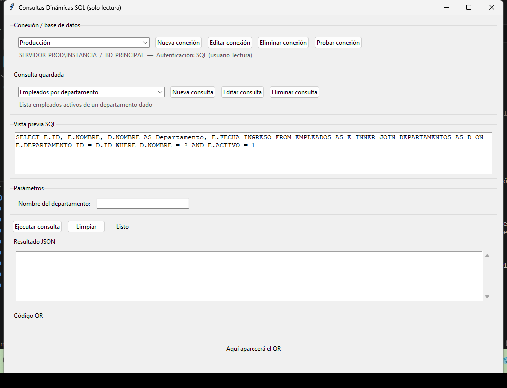
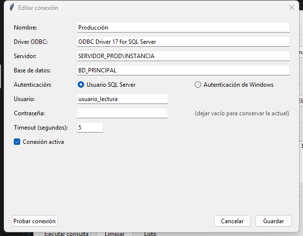
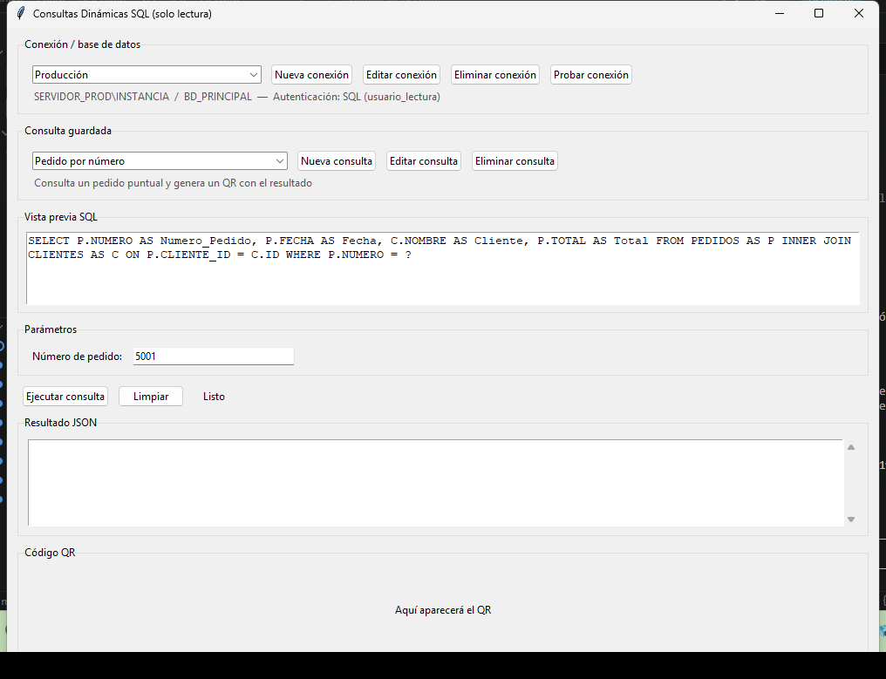
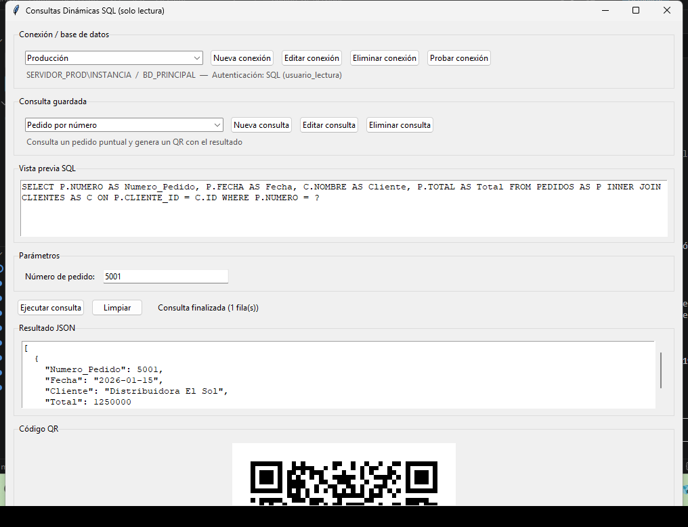
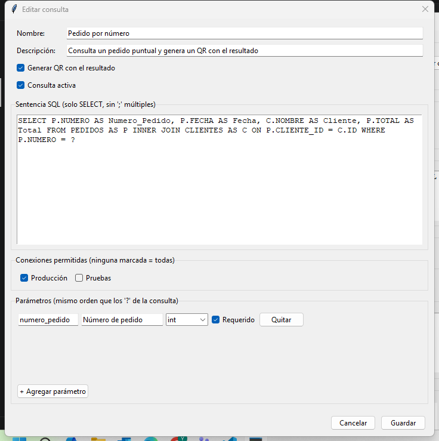
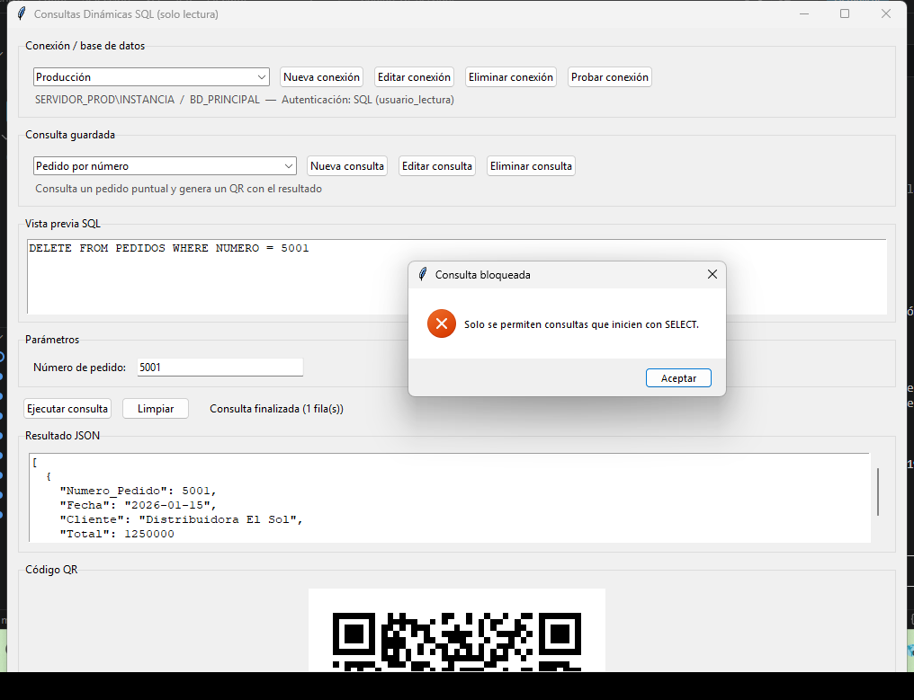

# Consultas Dinámicas SQL (solo lectura) con QR

Aplicación de escritorio para uso interno que permite ejecutar consultas SQL Server
predefinidas y guardadas por el usuario, sin tocar código para agregar o cambiar una
consulta. Cada consulta se define una vez (nombre, SQL, parámetros) desde la propia
interfaz, queda disponible en un selector, y al ejecutarla el resultado se muestra en
pantalla en JSON y, opcionalmente, como código QR para escanear en otra estación.

La aplicación maneja **múltiples conexiones a bases de datos** de forma dinámica: se
guardan varias configuraciones de conexión (producción, pruebas, etc.), el usuario elige
con cuál trabajar desde un selector en la ventana principal, y las consultas se ejecutan
contra la base seleccionada — sin editar código ni el archivo `.env`. Las contraseñas de
SQL Server no se guardan en texto plano: se almacenan en el Administrador de credenciales
de Windows.

El único requisito de seguridad no negociable: la aplicación **nunca** ejecuta nada que
no sea un `SELECT` de una sola sentencia. Cualquier intento de `INSERT`, `UPDATE`,
`DELETE`, `DROP`, `EXEC`, procedimientos almacenados, múltiples sentencias, etc. se
bloquea antes de tocar la base de datos.

## Stack

- **Lenguaje**: Python 3.
- **Interfaz**: Tkinter / ttk (aplicación de escritorio nativa, sin navegador).
- **Base de datos**: SQL Server vía `pyodbc`, con consultas siempre parametrizadas.
- **QR**: `qrcode` + `Pillow` para generar y mostrar el código a partir del resultado.
- **Configuración**: `python-dotenv` para variables generales (`.env`), y dos archivos JSON
  locales — `db_connections.json` (conexiones guardadas) y `queries_config.json` (consultas
  guardadas) — sin requerir base de datos ni backend propio.
- **Credenciales**: `keyring` para guardar las contraseñas SQL en el Administrador de
  credenciales de Windows, en vez de texto plano.
- **Empaquetado**: PyInstaller, para distribuir la app como un `.exe` de Windows sin
  requerir Python instalado en el equipo del usuario final.

## Estructura del proyecto

```
README.md
assets/                                    # Capturas usadas en este README
Codigo Qr Dinamico/
├── main_dynamic.py                 # Aplicación completa (UI, validación de seguridad, acceso a datos)
├── db_connections.example.json     # Ejemplo de conexiones a bases de datos (datos ficticios)
├── queries_config.example.json     # Ejemplo de formato de consultas guardadas (datos ficticios)
├── .env.example                    # Ejemplo de variables generales (rutas, logging, límite de filas)
├── crear_login_solo_lectura.sql    # Script opcional para el DBA: login de SQL Server solo-lectura
├── test_security.py                # Batería de pruebas de la validación de solo lectura
└── test_smoke.py                   # Chequeo rápido de validación, conexiones y allowed_connections
```

Este repositorio contiene únicamente la herramienta de consultas dinámicas, dentro de
`Codigo Qr Dinamico/`. Los archivos reales `db_connections.json` (con servidores internos)
y `queries_config.json` (con las consultas y nombres de tablas propios del ERP), el `.env`,
y la versión anterior de la aplicación (una sola consulta fija embebida en el código) son
internos y no se publican aquí.

## Requisitos previos

- Python 3.10+
- Driver ODBC de SQL Server instalado en el sistema (por ejemplo, "ODBC Driver 17 for
  SQL Server"). Descarga: https://learn.microsoft.com/es-es/sql/connect/odbc/download-odbc-driver-for-sql-server?view=sql-server-ver17
- Dependencias:

```
pip install pyodbc qrcode pillow python-dotenv keyring pyinstaller
```

## Configuración

Todos los pasos siguientes se ejecutan dentro de la carpeta `Codigo Qr Dinamico/`:

```
cd "Codigo Qr Dinamico"
```

1. (Opcional) Copia `.env.example` a `.env`. El `.env` ya **no** contiene las conexiones a
   la base de datos: solo tiene variables generales, todas con valores por defecto, así que
   este paso es opcional:

   ```
   CONNECTIONS_FILE=db_connections.json   # ruta del archivo de conexiones
   QUERIES_FILE=queries_config.json       # ruta del archivo de consultas
   LOG_LEVEL=INFO                         # DEBUG / INFO / WARNING / ERROR
   MAX_ROWS=500                           # límite máximo de filas por consulta
   ```

2. Arranca la app y crea tus conexiones desde el botón **"Nueva conexión"** (servidor, base
   de datos, tipo de autenticación, usuario/clave, timeout). Se guardan en
   `db_connections.json` y la contraseña queda en el Administrador de credenciales de
   Windows, no en el JSON. Como punto de partida también puedes copiar
   `db_connections.example.json` a `db_connections.json` y editarlo.

3. Crea tus consultas desde el botón **"Nueva consulta"** — el `queries_config.json` se
   genera solo si no existe. También puedes partir de `queries_config.example.json`.

4. (Recomendado) Pide a tu DBA que ejecute `crear_login_solo_lectura.sql` para que cada
   conexión use un login que solo tiene permiso `SELECT`, como segunda capa de defensa
   además de la validación que hace la propia aplicación.

## Ejecutar el proyecto

Desde dentro de `Codigo Qr Dinamico/`:

```
python main_dynamic.py
```

Para generar el ejecutable de Windows:

```
pyinstaller --noconfirm --onefile --windowed --name "Consultas Dinamicas" main_dynamic.py
```

El `.exe` resultante debe distribuirse junto con sus archivos de configuración
(`db_connections.json`, `queries_config.json` y, si lo usas, `.env`) en la misma carpeta:
se leen del directorio de trabajo, no quedan empaquetados dentro del exe. Las contraseñas
SQL viven en el Administrador de credenciales de Windows del usuario, así que en cada
equipo nuevo hay que reingresarlas una vez editando la conexión.

> Si al abrir el `.exe` aparece un error de "backend" de credenciales, agrega
> `--hidden-import keyring.backends.Windows` al comando de PyInstaller.

## Cómo se usa (paso a paso)

### 1. Ventana principal



- **Conexión / base de datos**: selector con todas las conexiones activas guardadas en
  `db_connections.json`. Al elegir una, debajo aparece el servidor, la base y el tipo de
  autenticación. Las consultas se ejecutan contra la conexión seleccionada.
- **Nueva conexión / Editar conexión / Eliminar conexión / Probar conexión**: administran
  las conexiones a bases de datos (ver sección siguiente).
- **Consulta guardada**: selector con las consultas activas de `queries_config.json`
  permitidas en la conexión seleccionada. Al elegir una, aparece su descripción justo debajo.
- **Nueva consulta / Editar consulta / Eliminar consulta**: administran las consultas
  guardadas.
- **Vista previa SQL**: muestra el `SELECT` exacto que se va a ejecutar, de solo lectura
  (no se puede editar desde aquí — para cambiarlo hay que usar "Editar consulta").
- **Ejecutar consulta / Limpiar**: ejecutan la consulta seleccionada o limpian el
  resultado y el QR en pantalla.
- **Resultado JSON**: el resultado de la consulta, siempre en JSON.
- **Código QR**: si la consulta tiene el QR habilitado, aquí aparece el código generado
  a partir del resultado.

### 2. Crear y probar una conexión a base de datos

Con **"Nueva conexión"** se abre un formulario para definir una conexión sin tocar código:



- **Nombre**: como aparecerá en el selector de conexiones (por ejemplo, "Producción").
- **Driver ODBC**, **Servidor** y **Base de datos**: datos de conexión a SQL Server.
- **Autenticación**: usuario SQL Server (usuario + contraseña) o autenticación de Windows
  (usa la sesión actual, sin usuario/clave).
- **Contraseña**: nunca se muestra en pantalla y no se guarda en el JSON — queda en el
  Administrador de credenciales de Windows. Al editar una conexión, dejar el campo vacío
  significa "conservar la contraseña actual".
- **Timeout** y **Conexión activa** (si se desmarca, se guarda pero no aparece en el selector).
- **Probar conexión**: verifica que los datos funcionen (ejecuta `SELECT 1`) antes de
  guardar, incluso con una contraseña recién digitada.

También puedes probar la conexión ya seleccionada desde el botón "Probar conexión" de la
ventana principal. **Editar conexión** abre el mismo formulario con los datos cargados;
**Eliminar conexión** la borra de `db_connections.json` y elimina su contraseña guardada
(pide confirmación antes).

### 3. Elegir una consulta y llenar sus parámetros

Al seleccionar una consulta con parámetros (por ejemplo, una que filtra por número de
pedido o por nombre de departamento), la app genera automáticamente un campo por cada
parámetro declarado, con el tipo correcto (texto, entero, decimal o fecha):



Si dejas vacío un parámetro marcado como obligatorio, o escribes un valor que no
corresponde al tipo (por ejemplo, letras en un campo entero), la app lo rechaza antes de
tocar la base de datos y te dice cuál es el problema.

### 4. Ejecutar y ver el resultado + QR

Al presionar **"Ejecutar consulta"**, el resultado aparece como JSON y, si esa consulta
tiene marcada la opción "Generar QR", el código QR se genera a partir de ese mismo JSON:



Si la consulta no devuelve filas, no hay nada que codificar: el panel del QR lo indica
explícitamente ("Sin resultados: no hay datos para generar el QR") en vez de quedar en
blanco sin explicación.

### 5. Crear una consulta nueva

Con **"Nueva consulta"** se abre el formulario para definir una consulta desde cero, sin
tocar código:



- **Nombre**: como aparecerá en el selector de la ventana principal.
- **Descripción**: texto corto que se muestra debajo del selector al elegirla.
- **Generar QR con el resultado**: si se marca, cada ejecución exitosa genera un QR.
- **Consulta activa**: si se desmarca, la consulta se guarda pero no aparece en el
  selector (útil para dejarla pausada sin borrarla).
- **Sentencia SQL**: el `SELECT` a ejecutar. Los parámetros van como `?` en el orden en
  que se van a llenar (igual que en `pyodbc`).
- **Parámetros**: un botón "+ Agregar parámetro" por cada `?` de la consulta, en el mismo
  orden. Cada parámetro tiene nombre interno, etiqueta visible, tipo (`str`/`int`/`float`/
  `date`) y si es obligatorio.
- **Conexiones permitidas**: opcionalmente puedes marcar en qué conexiones se puede ejecutar
  la consulta. Si no marcas ninguna, la consulta está disponible en todas las conexiones.
- **Guardar**: antes de guardar, valida que el SQL sea de solo lectura y que la cantidad
  de parámetros coincida con la cantidad de `?` — si algo no cuadra, explica exactamente
  qué corregir.

**Editar consulta** abre el mismo formulario con los datos ya cargados; **Eliminar
consulta** la borra de `queries_config.json` (pide confirmación antes).

### 6. Qué pasa si se intenta algo que no sea solo lectura

Tanto al guardar como al ejecutar, cualquier intento de `INSERT`, `UPDATE`, `DELETE`,
`DROP`, `EXEC`, procedimientos, o varias sentencias separadas por `;`, se bloquea antes de
tocar la base de datos:



## Funcionalidades

- Múltiples conexiones a bases de datos configurables: crear, editar, eliminar,
  activar/inactivar y probar conexiones desde la interfaz (persisten en
  `db_connections.json`, sin tocar código ni el `.env`).
- Selección de la base de datos a trabajar desde un selector en la ventana principal;
  las consultas se ejecutan contra la conexión elegida.
- Contraseñas SQL guardadas en el Administrador de credenciales de Windows (vía `keyring`),
  nunca en texto plano ni mostradas en pantalla.
- Selector de consultas guardadas, con vista previa del SQL antes de ejecutar, filtrado por
  las conexiones permitidas de cada consulta (`allowed_connections`).
- Crear, editar y eliminar consultas guardadas desde la interfaz (persisten en
  `queries_config.json`, sin tocar código).
- Formularios de parámetros generados dinámicamente según el tipo declarado (texto,
  entero, decimal, fecha), con validación antes de ejecutar.
- Validación de solo lectura antes de guardar y antes de ejecutar cualquier consulta:
  bloquea `INSERT/UPDATE/DELETE/DROP/ALTER/CREATE/TRUNCATE/MERGE/EXEC/EXECUTE/USE/GRANT/
  REVOKE/DENY/BACKUP/RESTORE/PUT/INTO`, comandos de administración/DoS/exfiltración
  (`SHUTDOWN/KILL/DBCC/RECONFIGURE/WAITFOR/BULK/OPENROWSET/OPENQUERY/OPENDATASOURCE`),
  procedimientos (`sp_`/`xp_`) y sentencias múltiples separadas por `;`. Cubierta por
  `test_security.py` (58 casos, incluyendo intentos de evasión con comentarios y literales).
- Límite de filas por consulta configurable con `MAX_ROWS` (500 por defecto, del lado de la
  app) y advertencia si una consulta no tiene `TOP` ni `WHERE`, antes de ejecutarla.
- Resultado en JSON en pantalla y, si la consulta lo tiene habilitado, código QR generado
  a partir de ese mismo resultado.
- Ejecución en un hilo aparte para que la interfaz no se congele mientras consulta la base.
- Errores de conexión, de SQL y de validación registrados en `app.log`, con mensajes
  amigables en pantalla (sin exponer detalles técnicos ni credenciales).

## Notas

- No requiere backend ni servidor propio: es una app de escritorio autocontenida que se
  conecta directamente a SQL Server.
- La validación de solo lectura en la app es la primera línea de defensa, no la única: es un
  validador léxico, no un parser SQL completo, por lo que se recomienda además que cada
  conexión use una cuenta de SQL Server con permisos de solo lectura (`db_datareader`),
  ver `crear_login_solo_lectura.sql`.
- Las contraseñas quedan en el Administrador de credenciales de Windows del usuario y del
  equipo: el `db_connections.json` se puede copiar entre equipos, pero en cada equipo/usuario
  nuevo hay que editar la conexión y reingresar la contraseña una vez.
- El alcance de seguridad relevante es no exponer credenciales de conexión ni nombres de
  tablas/columnas internas de la empresa fuera de este repositorio.
